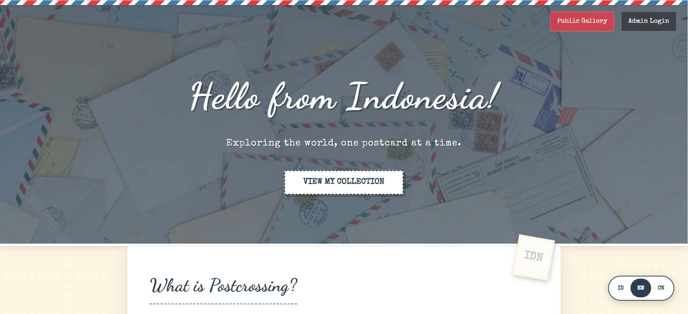
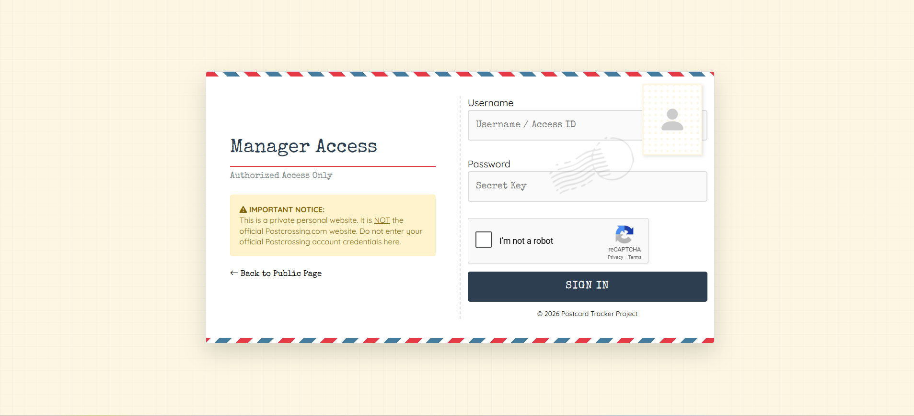
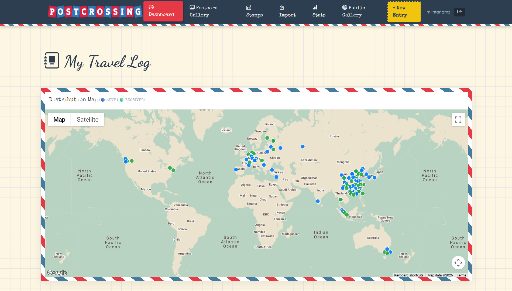
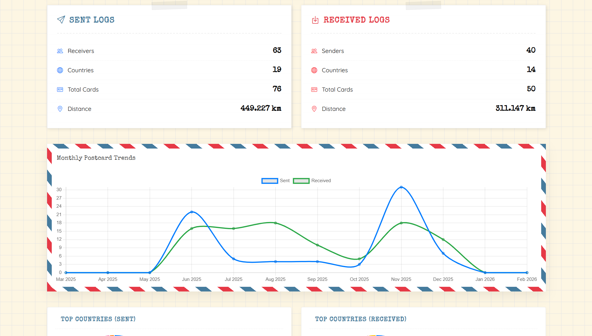
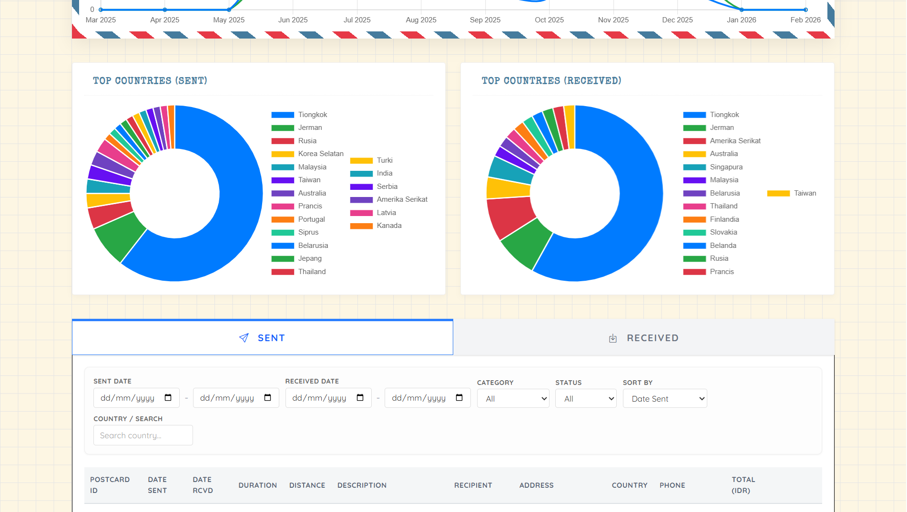
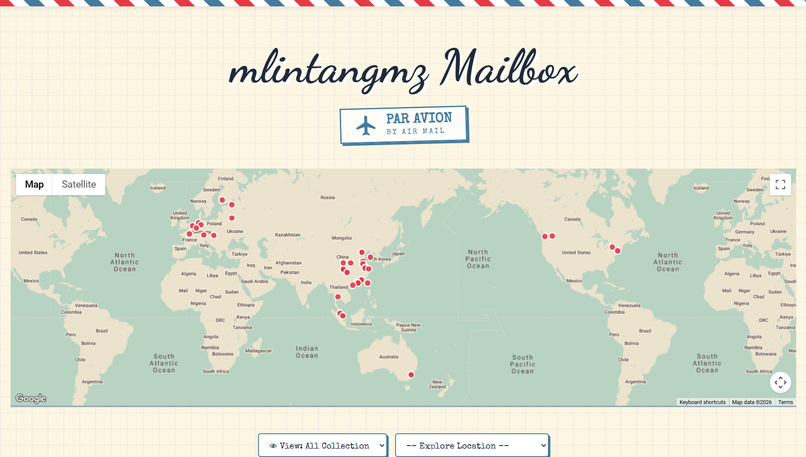
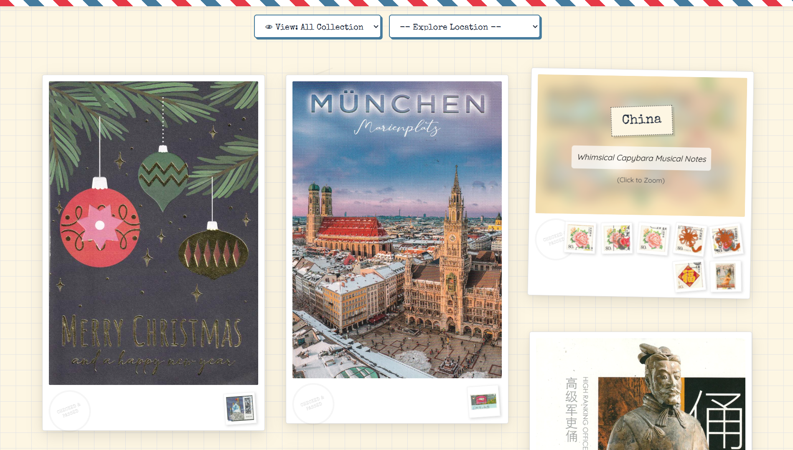

# Postcard Tracker 📬

A personal postcard collection management system built with Laravel and Livewire. Track your sent and received postcards, manage stamps, view statistics, and share your collection publicly.

## Features

### Core Features
- 📮 **Postcard Management** - Register sent/received postcards with photos
- 🗺️ **Interactive Maps** - Visualize postcard destinations on maps
- 📊 **Statistics** - View travel distances, delivery times, and country stats
- 🖼️ **Photo Gallery** - Browse your postcard and stamp collection
- 🌍 **Public Gallery** - Share your collection with the world
- 📱 **Responsive Design** - Works on desktop and mobile
- 🔐 **Secure** - Authentication with ReCaptcha protection

### Unique Features
- 🇨🇳 **Dual Map System** - Google Maps for global + AMap for China viewers
- 💱 **Multi-Currency Support** - Record stamp values in any currency with IDR conversion
- 📍 **Distance Tracking** - Calculate travel distance from your home location
- 📧 **Arrival Notifications** - Email alerts when recipients confirm delivery
- 🌏 **China Viewer Detection** - Auto-switches to AMap for China visitors

> 📖 See [Configuration Guide](docs/CONFIGURATION.md) for customization options

## Requirements

- PHP 8.2+
- MySQL/MariaDB
- Composer
- Node.js 20+

## Installation

### 1. Clone the repository
```bash
git clone https://github.com/mlintangmz2765/postcrossing-tracker.git
cd postcrossing-tracker
```

### 2. Install dependencies
```bash
composer install --no-dev --optimize-autoloader
```

### 3. Build assets (choose one method)

**Option A: Build on server**
```bash
npm install && npm run build
```

**Option B: Upload pre-built assets**
If Node.js is not available on server, build locally then upload:
```bash
# On local machine
npm run build
# Upload public/build folder to server via SCP/SFTP
```

### 3. Configure environment
```bash
cp .env.example .env
php artisan key:generate
```

Edit `.env` with your database and API credentials:
```env
DB_DATABASE=your_database
DB_USERNAME=your_username
DB_PASSWORD=your_password

GOOGLE_API_KEY=your_google_maps_key
AMAP_JS_KEY=your_amap_js_key
AMAP_WEB_KEY=your_amap_web_key

RECAPTCHA_SITE_KEY=your_recaptcha_site_key
RECAPTCHA_SECRET_KEY=your_recaptcha_secret_key

MAIL_MAILER=smtp
MAIL_HOST=your_smtp_host
MAIL_PORT=465
MAIL_USERNAME=your_email
MAIL_PASSWORD=your_password
```

### 4. Setup database
Import the database schema or run migrations:
```bash
php artisan migrate
```

### 5. Create storage link
```bash
php artisan storage:link
```

### 6. Create admin user (first-time only)
Access the setup page in your browser:
```
https://your-domain.com/setup/register.php
```
Fill in your desired username and password to initialize the system.

> ⚠️ **SECURITY WARNING:** Delete the entire `setup/` folder immediately after creating your admin account!
> ```bash
> rm -rf setup/
> ```
> Leaving this file on your server is a security risk as anyone could create new accounts.

### 7. (Optional) Cache for production
```bash
php artisan config:cache
php artisan route:cache
php artisan view:cache
```

## API Keys Required

| Service | Purpose | Get Key |
|---------|---------|---------|
| Google Maps | Map display & geocoding (non-China) | [Google Cloud Console](https://console.cloud.google.com/) |
| AMap (Gaode) | Map display & geocoding (China) | [AMap Console](https://lbs.amap.com/) |
| ReCaptcha v2 | Login protection | [Google reCAPTCHA](https://www.google.com/recaptcha/) |

## Screenshots

### Home Page


### Login


### Dashboard




### Gallery



## License

This project is open-sourced software licensed under the [MIT license](LICENSE).

## Author

Built with ❤️ by [mlintangmz](https://github.com/mlintangmz2765)
